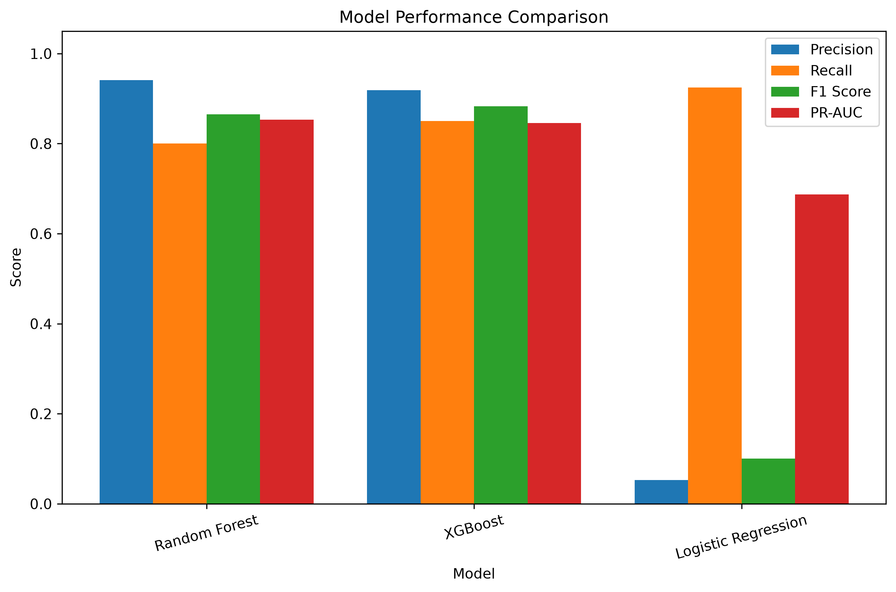
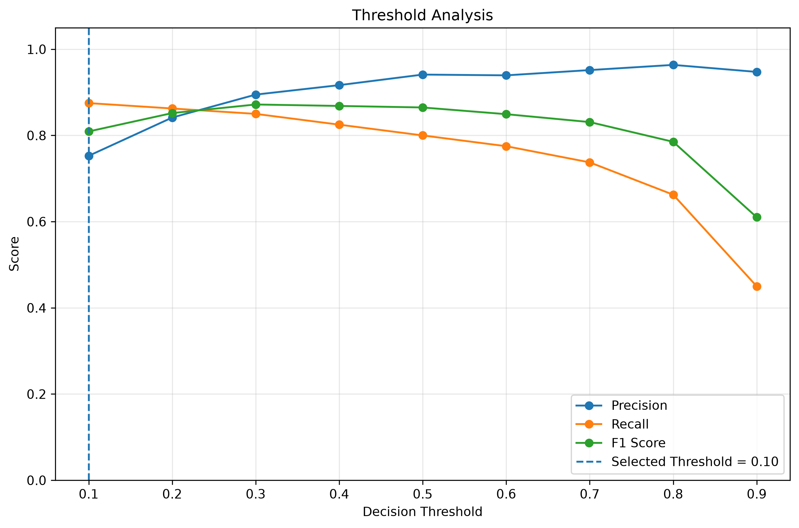
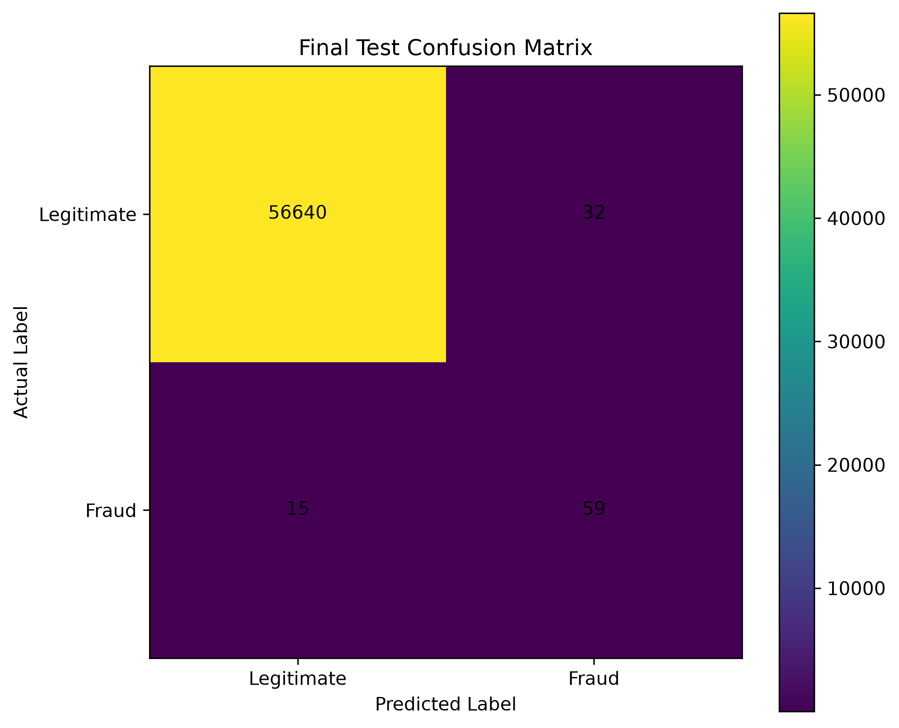
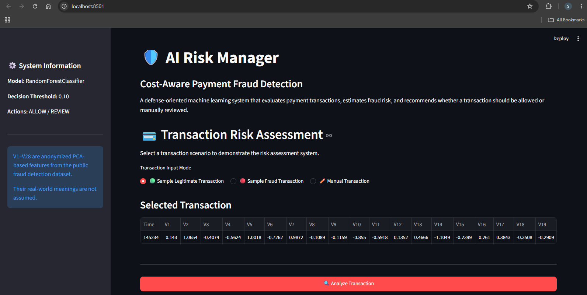
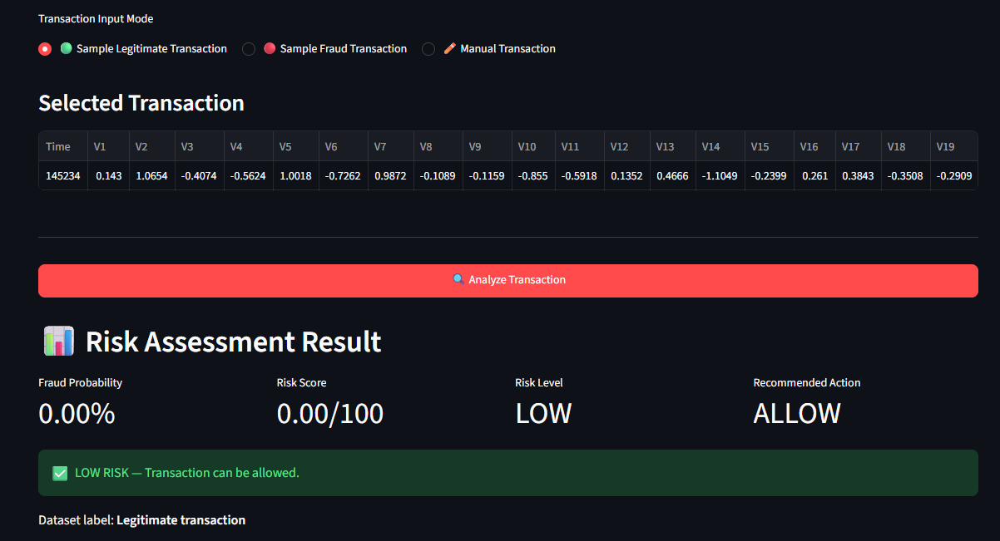
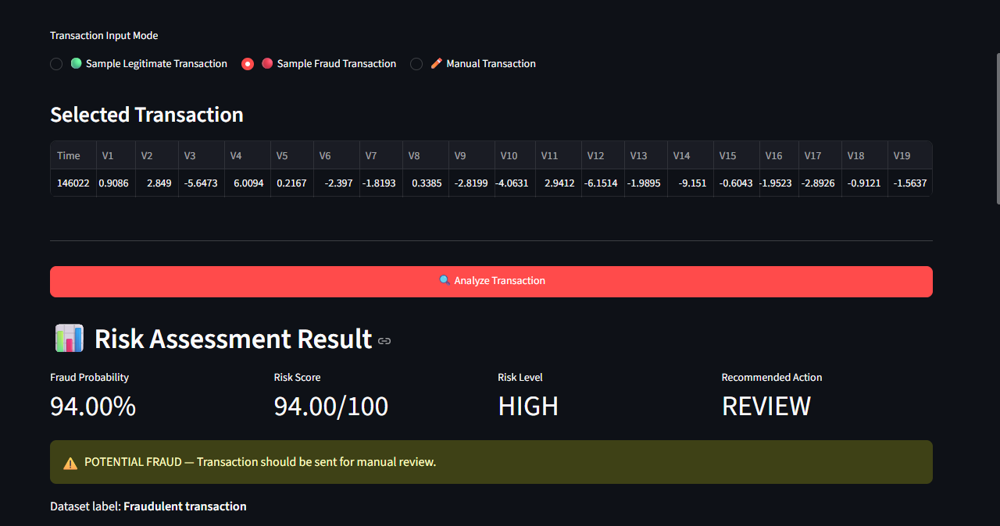

# AI Risk Manager — Cost-Aware Payment Fraud Detection

An AI-powered payment fraud detection and risk scoring system that evaluates payment transactions, estimates fraud risk, and recommends whether a transaction should be **allowed or manually reviewed**.

The system combines machine learning, cost-sensitive threshold optimization, risk scoring, and feature-based explanations in an interactive Streamlit dashboard.

---

## 🚀 Project Overview

The system analyzes payment transaction features and produces:

- Fraud probability
- Risk score (0–100)
- Risk level
- Recommended action: `ALLOW` or `REVIEW`
- Feature-based explanation
- Cost-aware decision threshold

The project focuses on **defensive fraud detection and merchant loss reduction**.

---

## 🏗️ System Architecture

```text
Payment Transaction
        ↓
Feature Processing
        ↓
Machine Learning Model
        ↓
Fraud Probability
        ↓
Risk Score (0–100)
        ↓
Cost-Aware Threshold
        ↓
ALLOW / REVIEW
        ↓
Risk Explanation
````

---

## 📊 Dataset

The project uses the publicly available **Credit Card Fraud Detection dataset**.

### Dataset characteristics

* 284,807 transactions
* 492 originally labeled fraudulent transactions
* 30 input features
* Highly imbalanced classification problem
* `V1–V28` are anonymized PCA-transformed features
* `Time` represents elapsed time
* `Amount` represents transaction amount

The raw dataset is intentionally **not included in this repository**.

---

## 🤖 Machine Learning Models

Three classification models were evaluated:

1. Logistic Regression
2. Random Forest
3. XGBoost

Model selection was based on **validation PR-AUC**, which is more informative than accuracy for highly imbalanced fraud detection.

### Validation Results

| Model               |  Precision |     Recall |   F1 Score |     PR-AUC |
| ------------------- | ---------: | ---------: | ---------: | ---------: |
| Logistic Regression |      5.30% |     92.50% |     10.03% |     68.75% |
| Random Forest       | **94.12%** |     80.00% |     86.49% | **85.34%** |
| XGBoost             |     91.89% | **85.00%** | **88.31%** |     84.54% |

Random Forest was selected as the final model because it achieved the highest validation **PR-AUC**.

### Model Comparison



---

## 🎯 Cost-Aware Threshold Optimization

Fraud detection involves an important trade-off:

* Missing fraud can cause financial loss.
* Flagging legitimate transactions can create unnecessary reviews.

Therefore, the system uses a **cost-sensitive threshold** rather than relying on the default probability threshold.

### Project assumptions

```text
False Positive Cost = 1
False Negative Cost = 10
```

The threshold is optimized using the **validation set** and then kept fixed for final evaluation.

### Selected threshold

```text
0.10
```

The decision rule is:

```text
Fraud probability < 0.10  → ALLOW
Fraud probability ≥ 0.10  → REVIEW
```

### Threshold Analysis



> The cost values above are project assumptions and do not represent real merchant loss estimates.

---

## 🧪 Final Held-Out Test Results

After model selection and threshold optimization, the final system was evaluated on an **untouched test set**.

| Metric              |      Result |
| ------------------- | ----------: |
| Precision           |  **64.84%** |
| Recall              |  **79.73%** |
| F1 Score            |  **71.52%** |
| PR-AUC              |  **82.59%** |
| False Positive Rate | **0.0565%** |

### Confusion Matrix

```text
                    Predicted
                 Legitimate  Fraud

Actual Legitimate    56640      32
Actual Fraud            15      59
```



The test set contains **74 fraud transactions**, so the reported metrics should be interpreted with this limitation in mind.

---

## 💻 Streamlit Dashboard

The project includes an interactive **Streamlit dashboard** for transaction risk assessment.

The dashboard supports:

* Sample legitimate transaction
* Sample fraud transaction
* Manual transaction input
* Fraud probability
* Risk score
* Risk classification
* Recommended action
* Feature-based explanation
* Final evaluation information

### Dashboard



### Legitimate Transaction

The system identifies the sample legitimate transaction as low risk and recommends allowing it.



### Fraudulent Transaction

The system identifies the sample fraudulent transaction as high risk and recommends manual review.



---

## 🔍 Risk Assessment Example

### Legitimate Transaction

```text
Fraud Probability : 0.00%
Risk Score        : 0/100
Risk Level        : LOW
Recommended Action: ALLOW
```

### Fraudulent Transaction

```text
Fraud Probability : 94.00%
Risk Score        : 94/100
Risk Level        : HIGH
Recommended Action: REVIEW
```

---

## 📁 Project Structure

```text
AI-Risk-Manager/
│
├── app.py
├── README.md
├── requirements.txt
├── .gitignore
│
├── 01_data_exploration.py
├── 02_prepare_data.py
├── 03_train_models.py
├── 04_threshold_analysis.py
├── 05_risk_scoring.py
├── 06_explanation.py
├── 07_evaluation.py
│
├── data/
│   └── Dataset files excluded from GitHub
│
├── model/
│   ├── best_fraud_model.joblib
│   └── best_threshold.txt
│
├── results/
│   ├── confusion_matrix.png
│   ├── model_comparison.png
│   └── threshold_analysis.png
│
├── screenshots/
│   ├── dashboard.png
│   ├── legitimate_result.png
│   └── fraud_result.png
│
├── notebooks/
│
└── src/
```

---

## ⚙️ How to Run Locally

### 1. Clone the repository

```bash
git clone https://github.com/sreemayi11/AI-Risk-Manager.git
cd AI-Risk-Manager
```

### 2. Create a virtual environment

```bash
python -m venv .venv
```

Activate it on Windows:

```powershell
.venv\Scripts\activate
```

### 3. Install dependencies

```bash
pip install -r requirements.txt
```

### 4. Prepare the dataset

Download the Credit Card Fraud Detection dataset and place the raw dataset in:

```text
data/creditcard.csv
```

The raw dataset is excluded from GitHub through `.gitignore`.

### 5. Run the Streamlit application

```bash
python -m streamlit run app.py
```

The application will open in the browser.

---

## 🧠 ML Pipeline

The project follows a structured machine learning workflow:

```text
01_data_exploration.py
        ↓
02_prepare_data.py
        ↓
03_train_models.py
        ↓
04_threshold_analysis.py
        ↓
05_risk_scoring.py
        ↓
06_explanation.py
        ↓
07_evaluation.py
```

This separates data preparation, model training, threshold optimization, risk scoring, explainability, and final evaluation.

---

## 🛡️ Defense-Only Design

This project is designed exclusively for:

* Fraud detection
* Transaction risk assessment
* Merchant loss reduction
* Defensive financial security

It does not provide techniques for bypassing fraud detection systems, exploiting payment platforms, or committing financial abuse.

---

## ⚠️ Limitations

* The dataset is a public research dataset and is **not Razorpay transaction data**.
* `V1–V28` are anonymized PCA features.
* The cost values are project assumptions rather than real merchant loss estimates.
* The model's probability output should be treated as a model-derived risk signal rather than a calibrated financial probability.
* The dataset is highly imbalanced and contains relatively few fraudulent transactions.
* Real-world deployment would require monitoring, retraining, drift detection, calibration, and business-specific cost modeling.

---

## 🧰 Technologies

* **Python**
* **Pandas**
* **NumPy**
* **Scikit-learn**
* **XGBoost**
* **Matplotlib**
* **Seaborn**
* **Joblib**
* **Streamlit**

---

## 📌 Future Improvements

* Probability calibration
* Real-time transaction monitoring
* Model drift detection
* Automated model retraining
* Business-specific cost modeling
* Authentication and role-based access
* Production deployment
* Database integration
* Advanced explainability methods such as SHAP

---

## 👩‍💻 Author

**Sreemayi**

B.Tech ECE | Aspiring Software Developer

Interested in Machine Learning, Backend Development, SQL, and building practical software systems.

